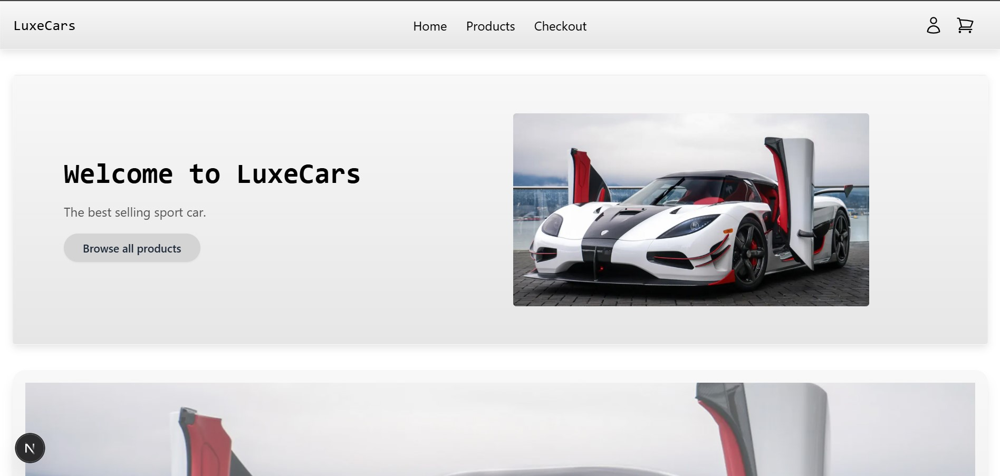

# LuxeCars E-Commerce Platform

Welcome to **LuxeCars**, the ultimate e-commerce platform for luxury sports cars. This project is built with modern web technologies to deliver a seamless and visually stunning shopping experience.

## 🚀 Features

- **Dynamic Product Listings**: Fetch and display products directly from Stripe.
- **Responsive Design**: Fully optimized for desktop and mobile devices.
- **Interactive Carousel**: Showcase featured products with a sleek carousel.
- **Modern UI**: Styled with Tailwind CSS for a clean and professional look.
- **Next.js Framework**: Server-side rendering and optimized performance.

## 🛠️ Tech Stack

- **Frontend**: [Next.js](https://nextjs.org/), [React](https://reactjs.org/)
- **Styling**: [Tailwind CSS](https://tailwindcss.com/)
- **Backend**: [Stripe API](https://stripe.com/docs/api)

## 📂 Project Structure

## 📸 Screenshots

### Homepage




## 🛒 Getting Started

### Prerequisites

- Node.js (v16 or higher)
- npm or yarn
- Stripe account for API integration

### Installation

1. Clone the repository:
   ```bash
   git clone https://github.com/your-username/luxecars.git
   cd luxecars in terminal
   ```
 2.  
   npm install
   ```

  3. Set up environment variables: Create a .env file in the root directory and add your Stripe API keys:
  ```
  STRIPE_SECRET_KEY=your_stripe_secret_key
  STRIPE_PUBLIC_KEY=your_stripe_public_key
  ```
 4.
  npm run dev

 5.
  ```
  http://localhost:3000
  ```

📦 Deployment
To deploy the project, use Vercel or any other hosting platform that supports Next.js.

🤝 Contributing
Contributions are welcome! Feel free to open issues or submit pull requests to improve the project.

📄 License
This project is licensed under the MIT License. See the LICENSE file for details.

🌟 Acknowledgments
Stripe for their amazing API.
Next.js for the robust framework.
Tailwind CSS for the beautiful styling.
Happy coding! 🚗💨 ```